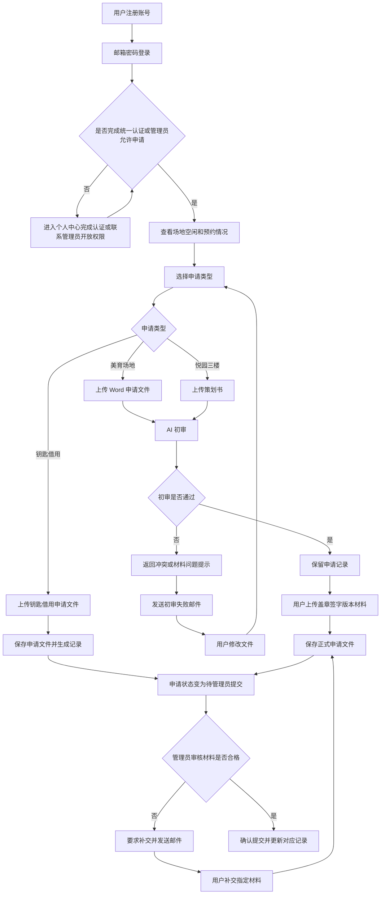
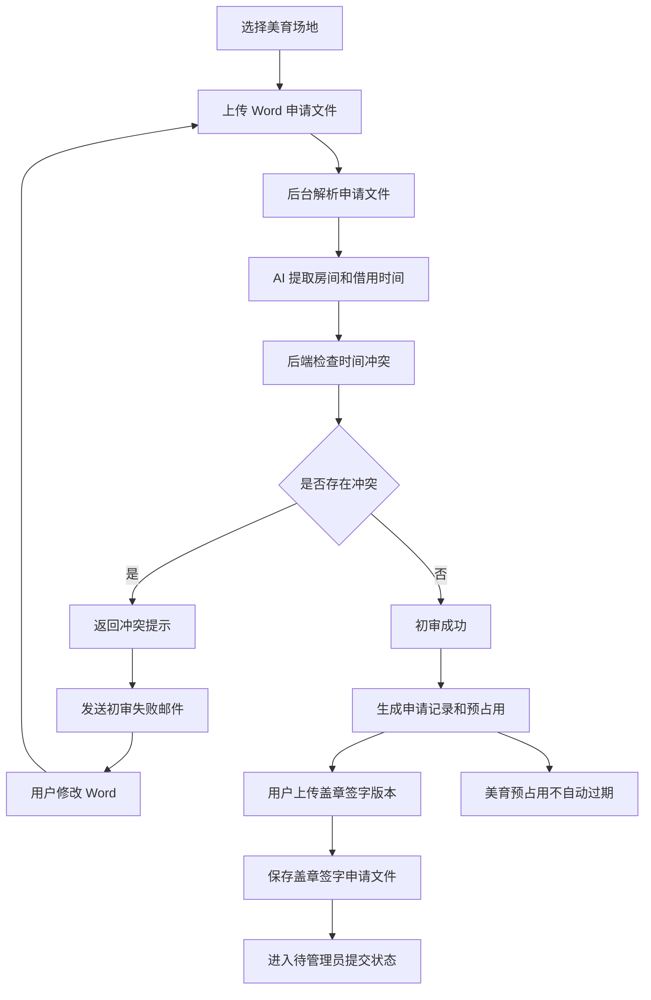
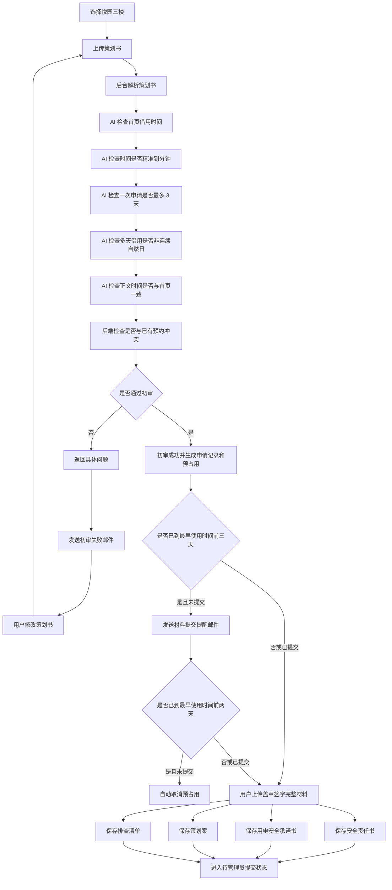
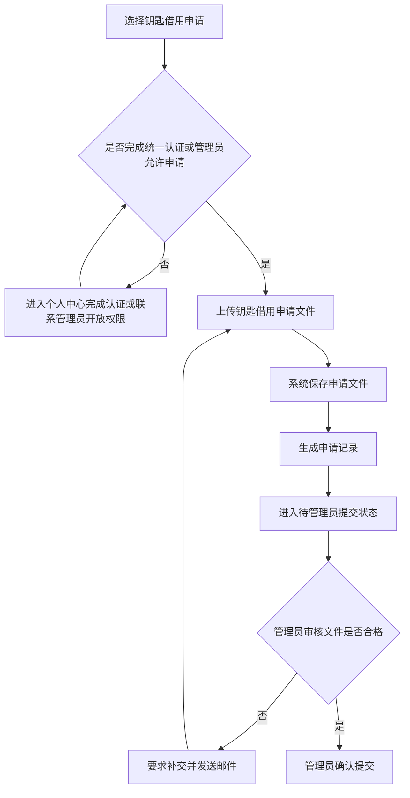
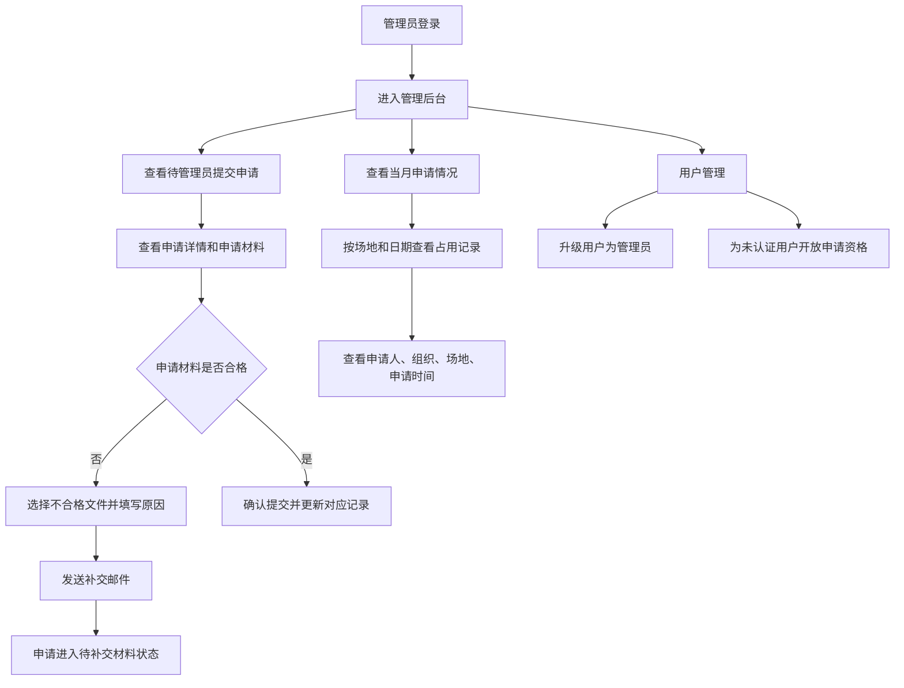
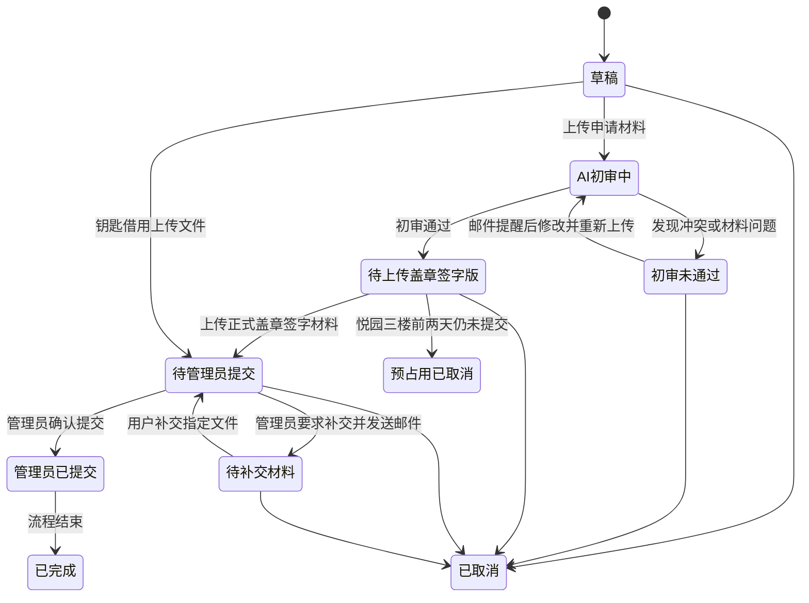

# 场地申请管理系统

本项目用于管理校内场地申请、钥匙借用申请、AI 初审、申请材料归档和管理员审核流转。系统面向普通用户和管理员两类角色，支持用户查看场地预约情况、提交不同类型申请材料、根据 AI 初审结果修改材料，并在材料符合要求后完成归档。

## 项目背景

现有场地申请通常依赖人工查看申请文件、人工比对时间冲突、线下收集盖章签字材料，流程较长且容易出现材料信息不一致、借用时间冲突、文件缺失等问题。本系统希望将场地申请流程线上化，并引入 AI 初审能力，优先自动检查申请文件中的关键规则，让管理员更专注于最终提交状态、申请记录和用户权限管理。

## 用户角色

### 普通用户

- 使用邮箱和密码注册账号。
- 登录后进入个人中心完成山东大学统一认证。
- 完成山东大学统一认证，或由管理员手动允许申请后，可以提交场地申请和钥匙借用申请。
- 可查看场地申请情况，包括空闲和已预约时间。
- 可在申请管理中查看自己的申请记录、初审结果、待补充材料和最终状态。

### 管理员

- 可查看所有申请记录。
- 可查看需要提交的申请记录，申请材料归档后申请进入“待管理员提交”状态，后续由管理员手动修改状态。
- 可按月查看场地申请情况，包括申请人、组织、场地、申请时间等。
- 可在审核申请材料时标记某些文件不合格，并要求用户补交指定文件。
- 可管理用户权限，包括升级用户为管理员、为未完成统一认证的用户手动开放申请资格。

## 申请类型

系统支持三类申请：

1. 美育场地
2. 悦园三楼
3. 钥匙借用

美育场地和悦园三楼需要 AI 初审，钥匙借用只需要上传申请文件，不需要 AI 审核。

## 核心功能

### 账号与认证

- 邮箱密码注册。
- 邮箱密码登录。
- 个人中心进行山东大学统一认证。
- 场地申请和钥匙借用申请资格采用并列规则：已完成山东大学统一认证，或管理员手动允许申请，满足任一条件即可申请。
- 管理员可为暂未完成统一认证的用户手动开放申请资格。

### 山东大学统一认证接入

统一认证采用 `SDU_login_API/sms_auth_api.py` 的短信验证码认证方式，不在本系统中收集或保存用户的山东大学统一认证密码。

认证流程：

- 用户在个人中心点击山东大学统一认证。
- 后端调用 `sms_auth_api.py` 的图片验证码接口，返回验证码图片并保存临时登录会话。
- 用户输入手机号和图片验证码后，后端调用短信验证码发送接口。
- 用户输入短信验证码后，后端调用短信登录接口完成山东大学统一认证。
- 认证成功后，后端从山东大学接口获取用户信息。
- 系统保存认证信息到 `AuthProfile`，并更新当前用户的统一认证状态。

认证成功后建议保存的信息：

- 学号
- 姓名
- 性别
- 人员类型
- 学院或单位
- 山东大学邮箱
- 手机号
- 认证时间

认证成功后的状态更新：

- 将用户标记为已完成山东大学统一认证。
- 将认证信息与当前邮箱注册账号绑定。
- 后续用户提交场地申请或钥匙借用申请时，系统可直接根据该状态判断其是否具备申请资格。

### 场地日历

- 展示场地空闲和已预约状态。
- 支持按场地、日期、月份查看申请占用情况。
- AI 初审通过后可生成预占用记录，避免用户补充正式材料期间被其他申请抢占。
- 美育场地预占用不设置自动过期时间，允许用户在使用后再上传盖章签字版本。
- 悦园三楼预占用有效期截至最早使用时间的两天前；如果最早使用时间前三天用户仍未提交盖章签字材料，系统发送邮件提醒；如果最早使用时间前两天仍未提交，系统自动取消预占用并释放时间段。
- 用户上传盖章签字文件后，申请进入待管理员提交状态。
- 管理员确认后，预占用记录转为正式占用；管理员也可以取消申请并释放对应时间段。

### 美育场地申请

用户申请美育场地时，直接上传 Word 申请文件。后台收到文件后交给 AI 初审，AI 主要负责从文件中提取申请房间、申请日期、申请时间段、申请组织等关键信息，并返回结构化检查结果。时间冲突等强规则由后端基于数据库中的预约记录进行判断，保证结果可复现、可审计。

AI 初审结果：

- 如果存在时间或房间冲突，系统返回冲突提示，并向用户注册邮箱发送初审失败提醒，用户修改 Word 文件后重新上传。
- 如果没有冲突，返回初审成功，系统保留申请记录。
- 初审成功后，用户上传盖章签字版本申请文件。
- 系统保存盖章签字申请文件，申请进入待管理员提交状态。
- 美育场地不设置预占用自动过期时间，允许用户在实际使用后再上传盖章签字版本。

### 悦园三楼申请

用户申请悦园三楼时，需要先上传策划书。后台收到后交给 AI 初审，重点检查策划书内容和时间规则。

AI 初审规则：

- 首页必须包含具体借用时间，时间需要精准到类似 `12:00-19:10` 的格式。
- 借用时间不能与已有申请记录冲突。
- 一次借用最多申请 3 天。
- 如果是多天借用，不允许连续自然日借用，可以采用隔一天一次等非连续方式。
- 策划书后文中的时间安排需要与首页借用时间一致。

AI 初审结果：

- 如果不符合规则，系统返回具体问题，并向用户注册邮箱发送初审失败提醒，用户修改策划书后重新上传。
- 如果符合规则，返回初审成功，系统保留申请记录。
- 初审成功后，用户上传盖章签字的完整材料。
- 系统保存盖章签字申请文件，申请进入待管理员提交状态。
- 悦园三楼初审成功后生成预占用；最早使用时间前三天仍未提交盖章签字材料时，系统发送邮件提醒；最早使用时间前两天仍未提交时，系统自动取消预占用。

悦园三楼盖章签字材料包括：

- 安全责任书
- 用电安全承诺书
- 策划案
- 排查清单

### 钥匙借用申请

用户申请钥匙借用时，也需要具备申请资格：完成山东大学统一认证，或由管理员手动允许申请。

钥匙借用流程较轻，不需要 AI 初审：

- 用户选择钥匙借用申请。
- 用户直接上传钥匙借用申请文件。
- 系统保存申请文件并生成申请记录。
- 申请进入待管理员提交状态。
- 管理员审核文件，如果文件不合格，可以要求用户补交并发送邮件提醒。
- 文件合格后，管理员确认提交并手动修改后续状态。

### 申请管理

用户可查看自己的申请记录，包括：

- 申请类型
- 申请对象：场地或钥匙
- 申请组织
- 借用时间
- 初审状态
- 材料上传状态
- 管理员提交状态
- 驳回或冲突提示

管理员可查看全部申请记录，并进行：

- 状态修改
- 要求用户补交不合格文件
- 月度申请情况查看，包括日历视图和表格视图
- 申请详情查看
- 用户权限管理

### 邮件通知

系统需要支持邮件发送功能，用于在关键节点主动提醒用户处理申请。

触发场景：

- AI 初审失败后，系统自动向用户注册邮箱发送提醒。
- 悦园三楼初审通过后，如果最早使用时间前三天用户仍未提交盖章签字材料，系统自动发送材料提交提醒。
- 悦园三楼初审通过后，如果最早使用时间前两天用户仍未提交盖章签字材料，系统自动取消预占用，并发送取消提醒。
- 管理员审核申请材料时，如果发现某些文件不合格，可以点击“要求补交”，系统向用户注册邮箱发送补交提醒。

邮件内容建议包含：

- 申请编号。
- 申请场地。
- 申请组织。
- 借用时间。
- 当前申请状态。
- 失败原因或不合格文件列表。
- 用户需要执行的下一步操作。
- 申请详情页链接。

管理员要求补交文件时，应支持选择具体文件类型并填写补交原因。例如：

| 申请类型 | 可要求补交的文件 |
| --- | --- |
| 美育场地 | 盖章签字申请文件 |
| 悦园三楼 | 安全责任书、用电安全承诺书、策划案、排查清单 |
| 钥匙借用 | 钥匙借用申请文件 |

邮件发送结果需要记录，便于管理员查看提醒是否发送成功。建议记录发送时间、收件人、邮件类型、关联申请、发送状态和失败原因。

### 材料版本管理

用户可能会因为 AI 初审未通过而多次上传修改版文件。系统需要保存每一次上传记录，避免覆盖历史材料。

管理员要求用户补交文件时，补交文件不覆盖旧文件，而是生成新的文件版本。旧文件需要保留，并标记为不合格，方便管理员追踪每次补交和审核记录。

建议记录：

- 原始上传文件。
- 文件版本号。
- 上传时间。
- AI 初审结果。
- 失败原因或修改建议。
- 管理员审核结果。
- 不合格原因。
- 是否为当前有效版本。
- 是否为最终盖章签字版本。

例如同一条申请可能包含：

| 版本 | 文件类型 | 状态 |
| --- | --- | --- |
| 第 1 版 | 策划书 | 初审未通过 |
| 第 2 版 | 策划书 | 初审未通过 |
| 第 3 版 | 策划书 | 初审通过 |
| 正式版 | 盖章签字材料 | 已归档 |
| 补交版 | 盖章签字材料 | 管理员审核通过 |

### 文件上传安全

系统会接收 Word、PDF、盖章签字文件等材料，需要对文件上传、存储和访问做安全控制。

建议规则：

- 限制文件类型，仅允许 `.doc`、`.docx`、`.pdf` 等业务需要的格式。
- 限制单个文件大小，避免超大文件影响服务稳定性。
- 使用服务端生成的文件名保存文件，避免直接使用用户上传的原始文件名作为存储路径。
- 文件与申请记录绑定，只有申请人本人和管理员可以查看对应文件。
- 不允许未登录用户访问申请文件。
- 下载文件时通过后端鉴权接口读取，不直接暴露真实存储路径。
- 保留文件上传记录和下载记录，便于审计。
- 可选接入病毒扫描或文件安全检测，降低恶意文件风险。
- 对象存储或本地文件存储中的敏感配置不得提交到代码仓库。

### AI 与系统职责边界

AI 主要负责理解文件内容、提取结构化信息、检查文本内部一致性，并返回问题说明。后端系统负责执行强规则判断和状态流转。

钥匙借用申请不进入 AI 初审流程，系统只负责保存上传文件、生成申请记录，并交由管理员审核。

AI 建议输出结构化结果，例如：

```json
{
  "passed": false,
  "venueName": "悦园三楼",
  "organization": "某学生组织",
  "extractedTimeSlots": [
    {
      "date": "2026-06-12",
      "startTime": "12:00",
      "endTime": "19:10"
    }
  ],
  "issues": [
    {
      "type": "TIME_CONFLICT",
      "message": "2026-06-12 12:00-19:10 与已有申请冲突"
    }
  ]
}
```

后端系统根据 AI 提取出的时间、场地和组织信息，结合数据库中的预约记录进行最终判断，并负责将申请流转到对应状态。

## 推荐申请状态

| 状态 | 说明 |
| --- | --- |
| 草稿 | 用户已创建申请但未提交材料 |
| 待管理员提交 | 钥匙借用文件或正式申请材料已归档，等待管理员处理 |
| AI 初审中 | 材料已上传，等待 AI 检查 |
| 初审未通过 | 初审发现时间冲突或材料问题，系统已发送邮件提醒用户修改 |
| 待上传盖章签字版 | AI 初审通过，等待用户上传正式材料 |
| 待补交材料 | 管理员发现申请材料不合格，已发送邮件提醒用户补交 |
| 管理员已提交 | 管理员已确认提交 |
| 已完成 | 申请流程结束 |
| 预占用已取消 | 悦园三楼在最早使用时间前两天仍未提交正式材料，系统自动取消预占用 |
| 已取消 | 用户或管理员取消申请 |

## 总体流程图



## 美育场地申请流程图



## 悦园三楼申请流程图



## 钥匙借用申请流程图



## 管理员流程图



## 状态流转图



## 管理后台视图建议

管理员后台建议同时提供日历视图和表格视图：

- 日历视图用于快速查看每个场地在当月的占用情况。
- 表格视图用于按申请人、组织、场地、状态、申请时间进行筛选和检索。
- 申请详情页展示原始材料、AI 初审记录、材料版本、正式盖章签字材料、钥匙借用文件和管理员状态修改记录。
- 申请材料审核区支持对单个文件标记不合格，填写补交原因，并一键发送邮件提醒。
- 通知记录区展示系统自动邮件和管理员手动补交通知的发送状态。

## 建议数据对象

| 对象 | 说明 |
| --- | --- |
| User | 用户账号、邮箱、密码哈希、认证状态、申请权限、角色 |
| AuthProfile | 山东大学统一认证信息，如学号、姓名、学院、认证时间 |
| Venue | 场地信息，如名称、类型、可申请时间 |
| KeyResource | 钥匙资源信息，如钥匙名称、所属房间、可借用状态 |
| Application | 申请记录，包含用户、组织、申请类型、场地或钥匙、借用时间、状态 |
| ApplicationFile | 申请文件记录，包含原始文件、正式盖章签字文件、文件类型、版本号 |
| MaterialRequirement | 不同申请类型的材料要求，如必传文件、可补交文件、是否需要盖章签字 |
| AiReview | AI 初审记录，包含检查结果、冲突信息、修改建议 |
| ReservationCalendar | 场地时间表，用于记录预占用和正式占用时间段 |
| KeyBorrowRecord | 钥匙借用记录，用于保存 AI 提取出的借用钥匙、借用开始时间和预计归还时间 |
| AdminActionLog | 管理员操作记录，用于追踪状态修改和权限调整 |
| ApplicationStatusLog | 申请状态变更记录，用于追踪每次状态流转、操作人和原因 |
| NotificationLog | 通知记录，用于追踪邮件类型、收件人、发送状态、失败原因 |
| EmailTemplate | 邮件模板，用于维护初审失败、材料提醒、补交通知、取消预占用等通知内容 |
| FileAccessLog | 文件访问记录，用于追踪上传、下载、查看等文件操作 |

## 开发说明

当前仓库包含 `front-end` 前端子项目和 `back-end` 后端子项目。

前端使用 Vue 3 和 Vite。

```sh
cd front-end
pnpm install
pnpm dev
```

后端使用 FastAPI，运行在 conda 的 `fastapi` 环境中。

```sh
cd back-end
conda activate fastapi
pip install -r requirements.txt
cp .env.example .env
uvicorn app.main:app --reload
```

后端接口文档默认地址：

```text
http://127.0.0.1:8000/docs
```

系统登录认证采用 JWT：

```text
POST /api/v1/auth/register
POST /api/v1/auth/login
POST /api/v1/auth/refresh
GET  /api/v1/auth/me
```

登录成功后前端在后续请求中携带：

```http
Authorization: Bearer <access_token>
```

`refresh_token` 用于在 access token 过期后刷新登录状态。

系统登录账号支持两种形式：

- 注册邮箱。
- 已完成山东大学统一认证后绑定的学号。

当前后端已包含数据库迁移、文件上传与下载、AI 初审、模板下载、邮件通知、管理员状态流转、钥匙借还、初始化数据脚本和悦园三楼预占用过期处理。后续重点是前端页面联调、数据库端到端测试和部署配置。
